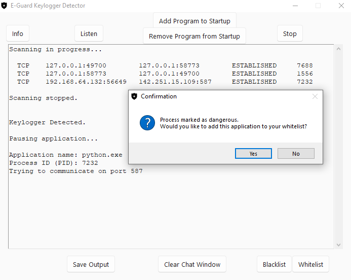
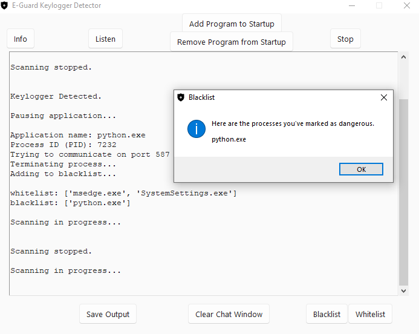
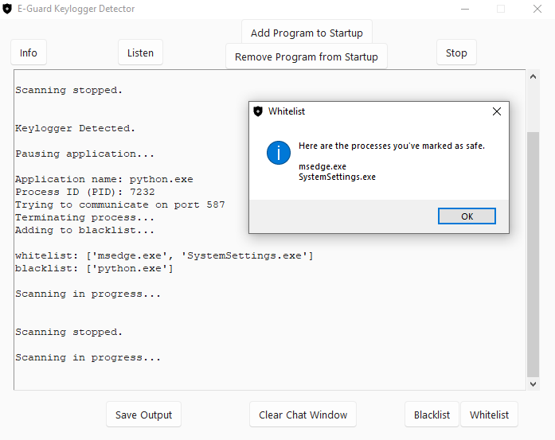
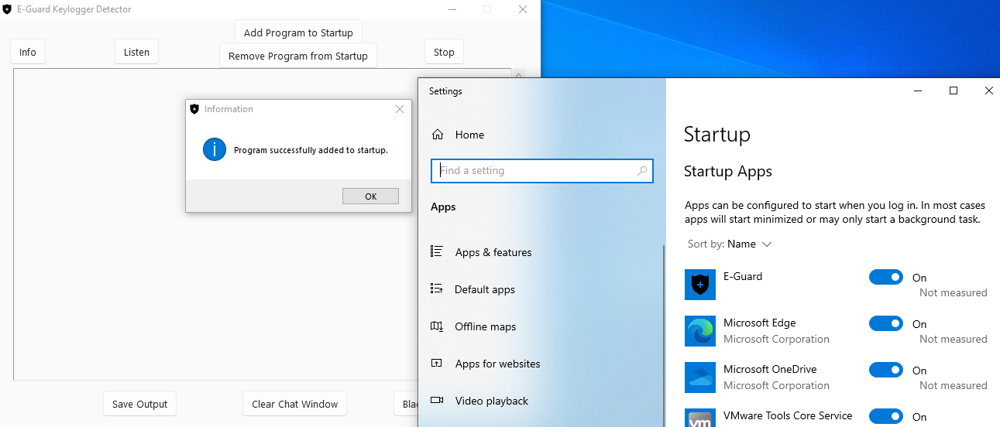
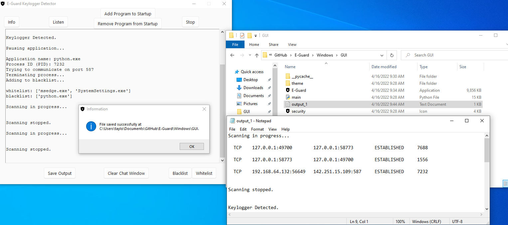
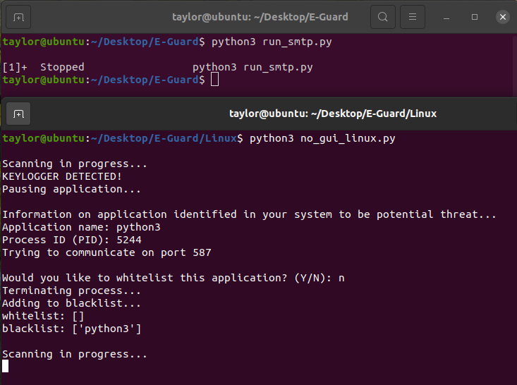
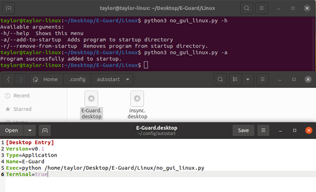

# E-Guard - Keylogger Detector
E-Guard is an open-source keylogger detection application which alerts users to applications attempting to send out 
information through popular SMTP servers.

## How It Works
This program focuses on combating keylogger software by monitoring all running applications, 
targeting those attempting to communicate through popular SMTP ports for Gmail, Yahoo, ATT, 
Microsoft, and AOL for both Windows and Linux machines. 

Once the software has targeted an application that is communicating through specific SMTP ports, 
the process will be paused, and the user will be notified of the potential threat. Then, the 
user will be asked if this process should be added to a trusted whitelist to continue running 
as normal or kill the process immediately and be added to a blacklist so that any other time this 
process is detected it will be automatically terminated.

## SMTP servers monitored by E-Guard
| **Popular SMTP Ports** |
|------------------------|
| 587                    |
| 465                    |
| 2525                   |

## How to Run

### Windows - *Requires administrator privileges*


**Important note**

*Trojan:Win32/Wacatac.B!ml false positives*: Currently debugging

* Once you clone this repository, the executable GUI application may be flagged by Windows Security as a false positive security alert. If this happens, navigate into the Windows Security app, then ``Virus & threat protection`` and click ``Current threats``. Select ``Protection history`` to access the quarantined threat. Click the drop-down arrow on the right, then select under ``Actions``, ``Restore``.

* If you choose to add E-Guard Keylogger Detector to your startup folder, you will need to follow the same steps listed above once more.

1. Visit [psutil](https://pypi.org/project/psutil/) to download and install this package, or use any python   package-management system, such as pip, to install using the following command:
   ```
   pip install psutil
   ```
2. Clone this repository using GitHub Desktop application.
3. Navigate to `Windows/GUI` directory
4. Execute `E-Guard` application and select `Listen` to begin running the application.

### Linux
1. Ensure Python 3.x is installed by checking 
   ```
   python3 --version
   ```
   Install by using the following command:
   ```
   sudo apt install python3.x
   ```
2. Install ``psuitl`` by using the following command: 
   ```
   sudo apt install python3-psutil
   ```
3. Clone this repository by using the following command:
   ```
   git clone https://github.com/aelder202/E-Guard.git
   ```
4. Navigate to `Linux` directory
5. To begin running the application, use the following command:
   ```
   python3 no_gui_linux.py
   ```

## Arguments

#### Windows
Open a command prompt window and navigate to the directory containing the cloned repository. Next,
`cd` into `Windows` and use 
```
python no_gui.py -h
```
or
```
python no_gui.py --help
```
for a list of available arguments.

### Linux
Open a terminal window and navigate to the directory containing the cloned repository. Next,
`cd` into `Linux` and use
```
python3 no_gui_linux.py -h
```
or
```
python3 no_gui_linux.py --help
```
for a list of available arguments.

## Screenshots

### Windows
 
 
 
 
 

### Linux
 
 
